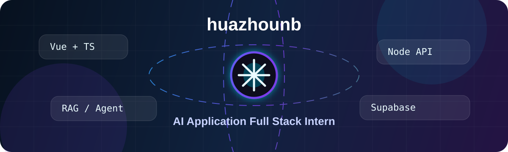
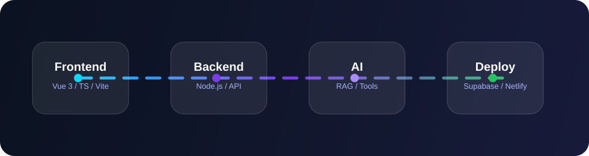
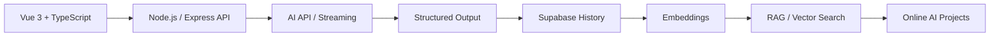

## 关于我

你好，我是 **huazhounb**，计算机专业学生，当前重点准备 **AI 应用 / 前端 / Web 全栈实习**。

我正在把学习重心从“会写功能”推进到“能做完整产品”：用 **Vue 3 + TypeScript + Node.js + Supabase + Netlify** 构建可以上线、可以展示、可以写进简历并在面试中讲清楚的 AI 应用。

- 求职方向：前端开发实习生、AI 应用开发实习生、Web 全栈实习生
- 当前主线：AI 实习求职助手 + 个人 RAG 知识库
- 技术关键词：Vue 3、TypeScript、Node.js、Express、Supabase、PostgreSQL、Netlify
- AI 应用关键词：Prompt、Streaming、Structured Output、Tool Calling、RAG、Embeddings

## 重点项目

### 1. AI 实习求职助手

**状态：开发中 / 作为主项目打磨**

面向实习投递场景的 AI 应用，目标是帮助用户把岗位 JD、个人技能、简历内容和面试准备串成一个完整工作流。

核心功能：

- 岗位 JD 分析：提取岗位职责、硬技能、加分项和匹配程度
- 技能差距分析：对比个人技能和岗位要求，输出优先补齐清单
- 简历优化建议：根据目标岗位给出更具体的项目描述和修改方向
- 面试题生成：围绕岗位要求生成问题、参考回答和复习重点
- 历史记录保存：使用 Supabase 保存分析记录，方便复盘和迭代
- AI 体验优化：支持流式输出、结构化结果展示、loading、重试和错误提示

技术栈：

`Vue 3` · `TypeScript` · `Vite` · `Node.js` · `Express` · `Supabase` · `OpenAI API` · `Netlify`

项目展示：

- Online Demo：整理中
- Repository：整理中
- README / Screenshots：持续补充中

### 2. 个人 RAG 知识库

**状态：规划中 / 作为 AI 能力展示模块**

把学习笔记、岗位要求和项目文档整理成可检索知识库，让 AI 基于自己的资料回答问题，重点展示 RAG 的完整应用链路。

核心功能：

- 文档录入：支持 Markdown / 学习笔记内容整理
- 文本切片：把长文本拆成适合检索的小片段
- 向量化：通过 Embeddings 将文本转换为向量
- 向量检索：使用 Supabase PostgreSQL + pgvector 做相似度搜索
- 基于资料回答：先检索相关内容，再让模型生成答案
- 引用展示：回答中展示来源片段，减少模型胡说

技术栈：

`Vue 3` · `TypeScript` · `Node.js` · `Supabase PostgreSQL` · `pgvector` · `Embeddings` · `RAG`

项目展示：

- Online Demo：规划中
- Repository：规划中
- README / Architecture：整理中

## 技术栈

  

### Frontend

### Backend / Database / Deploy

### AI Application

## 当前路线

## GitHub 数据

## 联系我

---

**正在从“会写代码”走向“能做产品、能上线、能解决问题”。**

