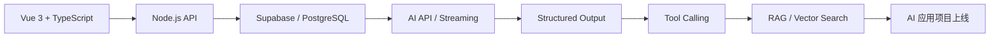

<div align="center">


</div>

## 👋 关于我

你好，我是 **huazhounb**，一名计算机专业大二学生，正在准备 **AI 应用全栈 / 前端开发实习**。

我目前的主线是：用 **Vue 3 + TypeScript + Node.js + Supabase + Netlify** 做能上线、能展示、能解决实际问题的 AI 应用，而不是停留在只看教程或只写 Demo。

- 🎯 求职方向：AI 应用全栈实习 / 前端开发实习生（AI 应用方向）
- 🧩 当前技术栈：Vue、TypeScript、Node.js、Supabase、GitHub、Netlify
- 🤖 AI 应用方向：Prompt、Streaming、Structured Output、Tool Calling、RAG
- 🚀 目标：做出 2 个可部署、可讲清楚、可写进简历的 AI 项目

## 🧰 技术栈

<div align="center">
  
</div>

### Frontend


### Backend / Database / Deploy


### AI Application


## 📌 正在学习

```txt
TypeScript 深化        ████████░░  80%
Vue 3 工程化           ████████░░  80%
Node.js API            ███████░░░  70%
Supabase / PostgreSQL  ██████░░░░  60%
AI Streaming           ██████░░░░  60%
RAG / Embeddings       █████░░░░░  50%
Tool Calling / Agent   ████░░░░░░  40%
```

## 🚀 重点项目规划

### 1. AI 简历 / 求职助手

> 开发中：面向实习求职场景的 AI 应用，帮助分析岗位 JD、生成技能差距、润色简历、生成面试题。

技术路线：

- Vue 3 + TypeScript 构建交互界面
- Node.js 后端封装大模型 API
- Supabase 保存岗位分析和历史记录
- 支持流式输出、结构化结果展示、错误提示
- Netlify 部署前端，后端使用云服务部署

### 2. 个人知识库问答系统

> 规划中：将学习资料、岗位要求、项目笔记整理成可检索知识库，通过 RAG 进行问答。

技术路线：

- 文本切片与 Embeddings
- Supabase pgvector 向量检索
- RAG 回答并展示引用来源
- 支持学习资料持续更新
- 用于复习、面试准备和项目沉淀

## 📊 GitHub 数据

<div align="center">


</div>

## 🗺️ 学习路线



## 📫 联系我

<div align="center">

[](mailto:huazhounb26@gmail.com)
[](https://github.com/huazhounb)

</div>

---

<div align="center">

**正在从“会写代码”走向“能做产品、能上线、能解决问题”。**


</div>
